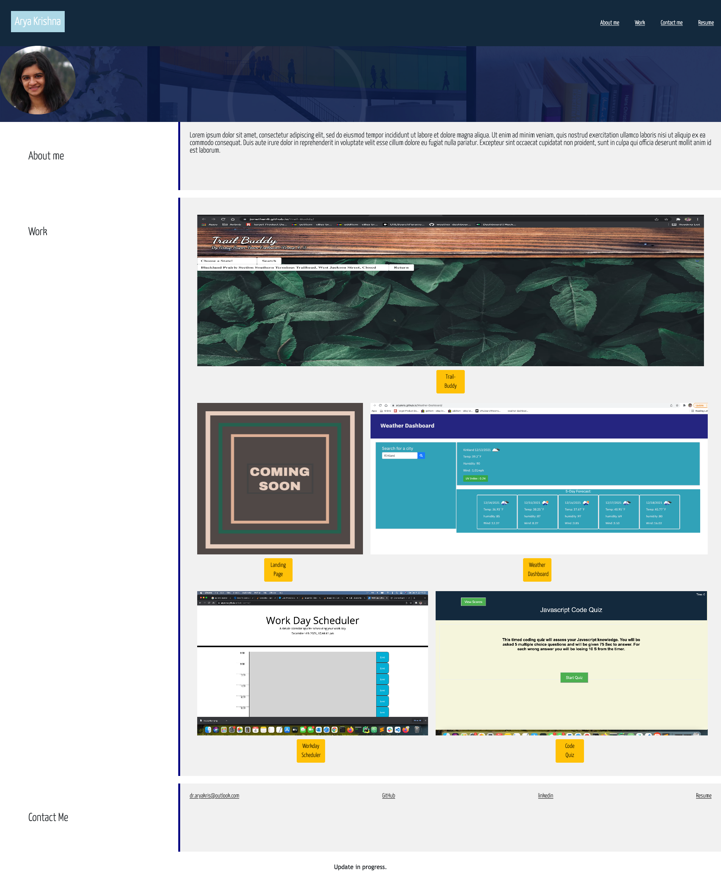

# AryaKris-Portfolio
To demonstrate relevant skills and abilities
The assignment includes building a portfolio from scratch and deploying it to GitHub. 

# Description 
This part includes the declarative header section, the body (where I tried to add the About me and Work sections) and the contact section and the footer. The first step was to give an outline for the portfolio by creating an index.html and then using an external CSS sheet to improvise the page with necessary stylings. 
I also added a reset.css to avoid issues with browser inconsistencies. 
The portfolio has my name "Arya Krishna" with a recent photo and links to sections about me. All the navigation links takes to the corresponding section . The acceptance criteria required the first application (in work) to be larger than the other applications. Also, when the image is clicked it takes to the deployed applications. I finally set the page to be able to be viewed in various screens and devices. 

Link to the deployed application -  (https://aryakris.github.io/AryaKris-Portfolio/)

# Updating the portfolio
* Added examples of work from deployed project and homeworks
* Added Links to GitHub profile and LinkedIn profile
* Added a link to downloadable PDF of my resume
* The final step was making sure the portfolio is mobile responsive

## 📝 License

Copyright © 2021 [Arya Krishna](https://github.com/AryaKris).  
This project is [MIT](https://github.com/AryaKris/AryaKris-Portfolio/blob/main/LICENSE) licensed.

